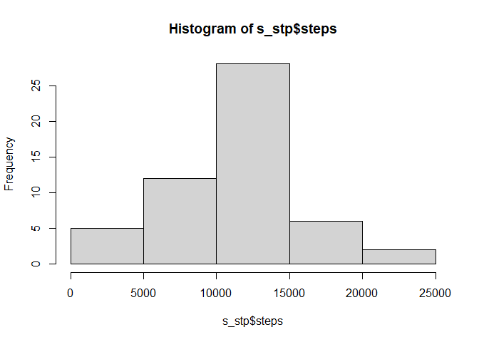
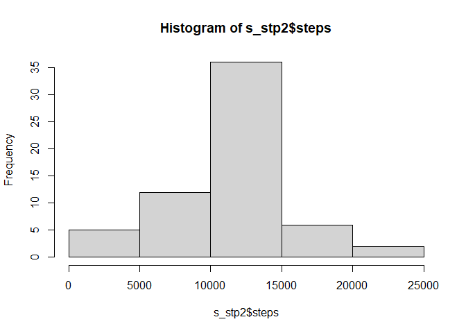
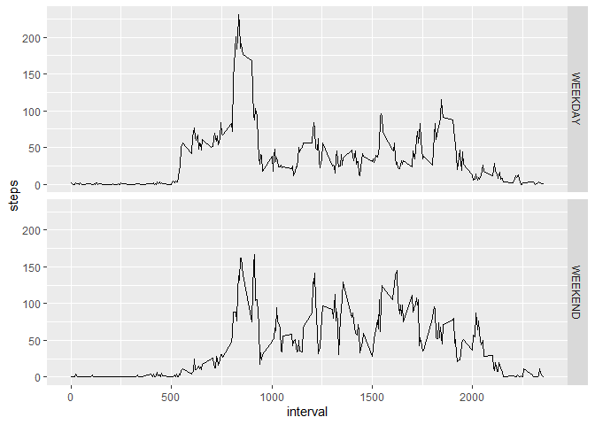

## R Markdown


```r
library(data.table)
library(dplyr)
```

```
## 
## Attaching package: 'dplyr'
```

```
## The following objects are masked from 'package:data.table':
## 
##     between, first, last
```

```
## The following objects are masked from 'package:stats':
## 
##     filter, lag
```

```
## The following objects are masked from 'package:base':
## 
##     intersect, setdiff, setequal, union
```

```r
library(ggplot2)
library(lubridate)
```

```
## 
## Attaching package: 'lubridate'
```

```
## The following objects are masked from 'package:data.table':
## 
##     hour, isoweek, mday, minute, month, quarter, second, wday, week,
##     yday, year
```

```
## The following objects are masked from 'package:base':
## 
##     date, intersect, setdiff, union
```

```r
WordD<-setwd("D:/workspace/R/RepData_PeerAssessment1")
fileToOpen<-"activity.csv"
DataToWork <- read.table(fileToOpen, header = TRUE, sep=",")
```

Calculate the total number of steps taken per day

```r
s_stp<-aggregate(steps~date,DataToWork,sum)
```

Make a histogram of the total number of steps taken each day

```r
hist(s_stp$steps)
```

<!-- -->

Calculate and report the mean and median of the total number of steps taken per day

```r
mean1<-mean(s_stp$steps,na.rm=TRUE)
median1<-median(s_stp$steps,na.rm=TRUE)
mean1
```

```
## [1] 10766.19
```

```r
median1
```

```
## [1] 10765
```

Make a time series plot (i.e. \color{red}{\verb|type = "l"|}type = "l") of the 5-minute interval (x-axis) and the average number of steps taken, averaged across all days (y-axis)

```r
m_stp_interval<-aggregate(steps~interval,DataToWork,mean)
ggplot(m_stp_interval)+geom_line(aes(interval,steps))
```

<!-- -->

Which 5-minute interval, on average across all the days in the dataset, contains the maximum number of steps?

```r
s_int<-aggregate(steps~interval,DataToWork,sum)
s_int[which.max(s_int$steps),1]
```

```
## [1] 835
```

Calculate and report the total number of missing values in the dataset (i.e. the total number of rows with \color{red}{\verb|NA|}NAs)

```r
table(is.na(DataToWork$steps))
```

```
## 
## FALSE  TRUE 
## 15264  2304
```

Devise a strategy for filling in all of the missing values in the dataset. The strategy does not need to be sophisticated. For example, you could use the mean/median for that day, or the mean for that 5-minute interval, etc.

```r
DataToWork2<-DataToWork
DataToWork2[is.na(DataToWork2)]<-m_stp_interval[,2]
```

Create a new dataset that is equal to the original dataset but with the missing data filled in.
Make a histogram of the total number of steps taken each day and Calculate and report the mean and median total number of steps taken per day. Do these values differ from the estimates from the first part of the assignment? What is the impact of imputing missing data on the estimates of the total daily number of steps?

```r
s_stp2<-aggregate(steps~date,DataToWork2,sum)
hist(s_stp2$steps)
```

<!-- -->

```r
mean2<-mean(s_stp2$steps)
median2<-median(s_stp2$steps)
mean2-mean1
```

```
## [1] 0
```

```r
median2-median1
```

```
## [1] 1.188679
```

```r
dif_steps<-sum(s_stp$steps)-sum(s_stp2$steps)
```

Create a new factor variable in the dataset with two levels – “weekday” and “weekend” indicating whether a given date is a weekday or weekend day.

```r
s_stp3<-mutate(s_stp2,day=weekdays(as.Date(s_stp2$date)))

f_days<-function(x){
  dweek<-c('lunes','martes','miércoles','jueves','viernes')
  day2 =  x %in% dweek
}

s_stp4<-mutate(s_stp3,day2=f_days(s_stp3$day))
DataToWork3<-mutate(DataToWork2,day=weekdays(as.Date(DataToWork2$date)))
DataToWork3<-mutate(DataToWork3,day2=f_days(DataToWork3$day))
DataToWork3[DataToWork3$day2==TRUE,5]<-"WEEKDAY"
DataToWork3[DataToWork3$day2==FALSE,5]<-"WEEKEND"
```
Make a panel plot containing a time series plot (i.e. \color{red}{\verb|type = "l"|}type = "l") of the 5-minute interval (x-axis) and the average number of steps taken, averaged across all weekday days or weekend days (y-axis). 

```r
DataToWork4<-aggregate(steps~interval+day2,DataToWork3,mean)
ggplot(DataToWork4)+geom_line(aes(interval,steps))+facet_grid(day2~.,)
```

<!-- -->

